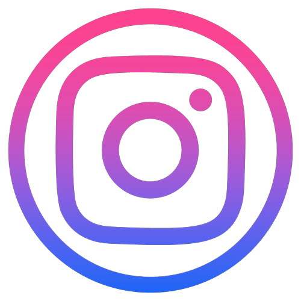
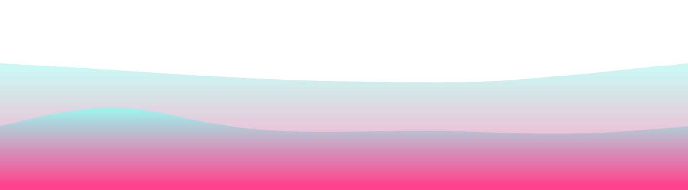

  
  
  

<h2></h2>

<h2 align="center"> Learned from SMIT and passionate about coding!   </h2> 

-   👨‍💻 I'm Rizwan Ahmed👋, an Undergraduate University student, I'm currently pursuing a Software Engineering Degree from the University of Karachi.    

-   🌳 I’m currently working as a MERN Stack Developer    

-   🌊 2024 Goals: Learn DevOps and Contribute to Open Source Projects.    

-   ☕ Interest: Coding, Games, Coffee, and Cars.    

<h2></h2>

 

<h2></h2>

   

  
  
  
  <h2> <strong> ⚙️ Technologies and Skills </strong></h2>
   
  
  
   

   
  
  <h2></h2>
  <h3> <strong> Languages, Frameworks, and Tools </strong></h3>
  
    
  <h2></h2>
  <h3> <strong> Actively Learning </strong></h3>
  
   
  <h2></h2>
  <h3> <strong> Planning to Learn </strong></h3>
  

<h2></h2>

<h2 align="center">💻 Workspace</h2>

   

 

 

  

 

<h2></h2>

  <h2> 🏆 My Github Stats </h2> 
    <h2></h2> 
  
  

  

  <h2 align="center">👨‍💻 Projects </h2> 
  
  
  
  
  
  

 

<h2></h2>

  <h2 align="center">✉️ Contact </h2>
  
  &nbsp
  
  &nbsp
  

